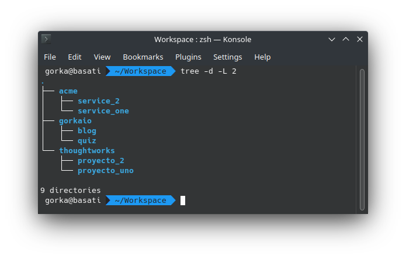

Como consultor trabajo en diferentes repositorios para Thoughtworks, nuestros clientes y algunos proyectos personales, como este blog. Para cada uno de ellos tengo diferentes necesidades trabajando con git. Por ejemplo, _comiteo_ con diferentes identidades dependiendo del entorno en el que estoy trabajando: uso mi email de Thoughtworks para proyectos internos, el email corporativo del cliente para el proyecto al que estoy asignado y mi email personal para mis propios proyectos. Como Spidey, tengo varias identidades. Y, dependiendo de las circunstancias, utilizo una u otra.


También como Spidey, equivocarme en la identidad que uso cuando actúo en un entorno concreto puede resultar un error fatal: _comitear_ en el repositorio de un cliente con mi identidad personal no estaría bien, pero hacerlo con la identidad de otro cliente puede ser un problema serio de confidencialidad.

Para facilitarme la vida, organizo mi trabajo en diferentes carpetas bajo una carpeta principal `Workspace` según estas identidades. Así, utilizo `~/Workspace/thoughtworks` para proyectos internos, `~/Workspace/gorkaio` para proyectos personales y `~/Workspace/acme` para los proyectos del cliente actual, "Acme".



Configurar git para cada repositorio individualmente es pesado y propenso a errores, pero podemos automatizar el cambio de identidad en función de la ruta actual. Veamos cómo.

Usando [_conditional includes_](https://git-scm.com/docs/git-config#_conditional_includes) podemos incluir un archivo de configuración de git dependiendo de una condición. Por ejemplo, el directorio actual. Si el valor proporcionado concuerda con el directorio de git, podemos incluir otro archivo de configuración como si su contenido se hubiera declarado en el punto en el que se hace el include:

```sh
; incluir para todos los repositorios en $HOME/to/group
[includeIf "gitdir:~/to/group/"]
  path = /path/to/foo.inc
```

Sabiendo esto, podemos crear un archivo de configuración específico en cada uno de los directorios de nuestro `Workspace`, y hacer que se incluya cuando estamos en un repositorio bajo esa ruta:

```sh
; ~/.gitconfig
[includeIf "gitdir:~/Workspace/thoughtworks/"]
  path = ~/Workspace/thoughtworks/.gitconfig
[includeIf "gitdir:~/Workspace/acme/"]
  path = ~/Workspace/acme/.gitconfig
[includeIf "gitdir:~/Workspace/gorkaio/"]
  path = ~/Workspace/gorkaio/.gitconfig
```

Para cada uno de estos espacios de trabajo podemos crear un `.gitconfig` que cambie nuestra identidad cuando estamos en un repositorio bajo su ruta:

```sh
; ~/Workspace/acme/.gitconfig
[user]
  name = Gorka López de Torre
  email = gorka_ext@acme.doh
```

¡Listo! Con esto ya nunca nos volveremos a equivocar de identidad al _comitear_ en un repositorio: mientras esté clonado en el espacio de trabajo correcto, siempre usará la identidad que hemos indicado. Incluso en repositorios nuevos, por lo que ni siquiera tenemos que pensar en ello.

Por supuesto, esto no sólo aplica al cambio de identidad. Para completar el círculo, podemos cambiar la identidad que usamos con SSH en función de la ruta de trabajo:

```sh
; ~/Workspace/acme/.gitconfig
[user]
  name = Gorka López de Torre
  email = gorka_ext@acme.doh
[core]
  sshCommand = ssh -i ~/.ssh/gorka_acme_rsa -F /dev/null
```

Un último truco: ¿a quién no le gustan los emojis? Si usas `zsh` puedes personalizar el prompt con un emoji que refleje la identidad git que estás usando en ese momento con [git-prompt-useremail](https://github.com/mroth/git-prompt-useremail) 👨‍🦲