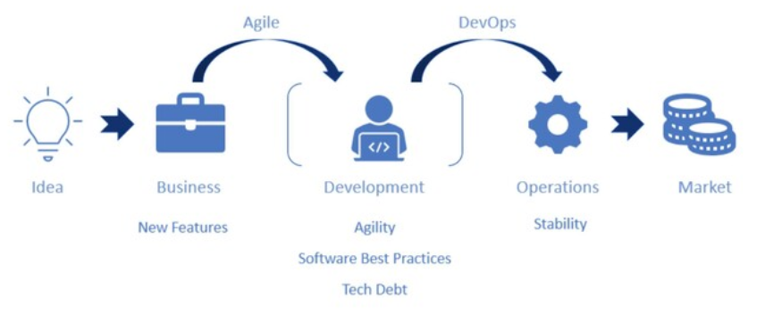

Cuando pensamos en el flujo de desarrollo de muchas empresas, partimos de una idea transformada en requisitos de negocio. Estos requisitos se pasan al equipo de desarrollo, que los implementa y deja los cambios en manos de operaciones para su puesta en producción y mantenimiento, de modo que finalmente lleguen al mercado. Este modelo de trabajo, sumamente compartimentado, tiene dos puntos de fricción claros:

### Negocio-Desarrollo
Negocio quiere poner muchas nuevas características en producción, y lo quiere cuanto antes. Los desarrolladores quieren implementar esos cambios, pero también garantizar la calidad de su trabajo y poder realizar mejoras técnicas. Para reducir esta fricción es para lo que normalmente aplicamos metodologías ágiles.

### Desarrollo-Operaciones
Una vez que hemos terminado de implementar una nueva característica, los desarrolladores queremos ponerla en producción cuanto antes y pasar a otra cosa. Y operaciones quiere poner estas cosas en producción, pero sabe por experiencia que los cambios ponen en peligro su principal cometido: mantener el sistema estable y fiable. Para resolver esta fricción es para lo que surgió DevOps.

## ¿Qué es SRE?

### SRE implementa DevOps

DevOps es un conjunto de prácticas y guías que intentan mejorar esa fricción entre desarrollo y operaciones con cinco puntos clave:

- Reducir los silos de conocimiento
- Aceptar el fallo como algo normal
- Implementar cambios graduales
- Mejorar las herramientas y la automatización
- Medir todo

Si DevOps es una guía general, SRE es una implementación concreta de esas guías. Una serie de prácticas y creencias que hemos visto que funcionan en el mundo real. SRE traduce los cinco puntos anteriores del siguiente modo:

- Reduce los silos de conocimiento, mediante la responsabilidad compartida.
- Acepta el fallo como algo normal, lo mide y establece criterios de evaluación y mejora continua.
- Implementa cambios graduales, mediante CI/CD y Feature Toggles, reduciendo el coste del riesgo.
- Mejora las herramientas y la automatización, con especial foco en el trabajo menos productivo.
- Mide todo, especialmente el trabajo poco productivo y la fiabilidad del servicio.

En un equipo de SRE queremos gente que esté motivada y capacitada para empujar esos cinco pilares. Gente capaz de automatizar procesos, de aunar conocimientos de ingeniería de software y de sistemas, y de utilizarlos para ayudar al diseño, construcción, despliegue y mantenimiento de grandes sistemas de modo escalable, confiable y eficiente. Gente que viva el pesimismo constructivo de esperar que ocurra lo mejor, pero planificar para lo peor. Que no se conforme con que «las cosas funcionan», porque sabe que la esperanza no es una estrategia.

## Áreas de práctica
### 1. Monitorización y Alertas

La primera área de práctica de SRE es monitorización y alertas. Automatizamos el registro de eventos de los sistemas, y alertamos a un humano únicamente cuando es estrictamente necesaria una decisión humana para poder continuar. Con esto conseguimos mejorar la velocidad de reacción, reducir los errores y evitar la fatiga de alertas, eso que ocurre cuando una o varias alertas no paran de sonar cada cierto tiempo y sabemos que, además, no es especialmente relevante y suele solucionarse solo al cabo de un tiempo. Cuando recibamos una alerta, debe ser una alerta realmente importante.

En alertas distinguimos dos tipos: pages y tickets. Un page requiere de la atención inmediata de un humano, es algo suficientemente grave como para despertar a un ingeniero a las tres de la mañana para que lo intente solucionar. Un ticket, por otro lado, require intervención humana pero puede esperar al horario de oficina.

### 2. Planificación de la capacidad

La planificación de la capacidad es la segunda área de práctica de SRE. Queremos planificar los recursos disponibles, la capacidad del servicio, para el crecimiento orgánico e inorgánico del producto. Y situarnos siempre en el punto óptimo de disponibilidad de recursos, porque tan malo es pagar por más de lo que realmente necesitamos como no contar con suficientes recursos para responder a un pico de demanda y sufrir una caída del servicio en consecuencia.

### 3. Gestión de cambios

Si habéis trabajado en alguna empresa en la que acumulan cambios durante meses y despliegan todo el mismo día a producción, sabéis la tensión que se vive en ese momento. Los grandes cambios conllevan grandes riesgos, y desarrolladores y administradores de sistemas viven esos despliegues más tensos que Espinete en una tienda de globos.

Por eso interesa hacer pequeños cambios graduales en producción mediante CI/CD, tener la posibilidad de activar o desactivar funcionalidades mediante Feature Toggles sin necesitar un nuevo despliegue o tener un sistema sencillo, sólido y automatizado para revertir los cambios.

_El objetivo de SRE no es no sufrir caídas en el servicio, si no maximizar la velocidad de desarrollo dentro de un margen de fiabilidad establecido._

### 4. Respuesta a emergencias

Las cosas se rompen, es un hecho. Lo único que podemos hacer al respecto es intentar mitigar los problemas y reducir la probabilidad de que vuelvan a ocurrir o, al menos, intentar que si ocurren su impacto sea menor.

Para tener una respuesta efectiva a emergencias necesitamos tener un criterio claro de qué consideramos una incidencia. Si nuestros usuarios están percibiendo una caída del servicio o una degradación en la calidad de este, eso probablemente es una incidencia. Si hemos perdido datos o alguien ha tenido que intervenir de forma significativa para resolver el problema, eso también parece una incidencia. Y si tardamos más tiempo del previsto en solucionar el problema, también podemos considerarlo una incidencia. ¿Y qué hacemos con las incidencias?

Un postmortem es un documento en el que intentaremos dar respuesta a cuál ha sido la incidencia y su gravedad, cuál ha sido la afectación a los usuarios o a la integridad de otros sistemas y, sobre todo, cuáles han sido las causas raíz y qué podemos hacer para limitar la probabilidad de recurrencia o reducir el impacto de esta. No es un castigo: es una oportunidad para mejorar la estabilidad del sistema.

Cuando uno está de guardia y recibe una alerta a las tres de la mañana, por muy buen ingeniero que sea, toda ayuda es poca. Por eso es importante mantener runbooks actualizados, precisos y fáciles de seguir. Los runbook recogen las incidencias comunes de un servicio junto con sus causas probables y métodos de mitigación o la solución conocida a ese problema. Aún así, es posible que el runbook no recoja el escenario concreto al que nos enfrentamos, que no sepamos cómo solucionar el problema y nos sintamos sobrepasados por la situación. En lugar de empeñarnos en ser los héroes del día mientras el tiempo va pasando en nuestra contra, es importante no entrar en pánico y, si es necesario, contactar con otros ingenieros que puedan echar una mano.

### 5. Cultura

Tan importante o más que cualquiera de las otras áreas de práctica es la cultura de un equipo SRE. Una cultura que debe estar basada en la no culpabilización de individuos o equipos, si no en la búsqueda de causas raíz y soluciones a estas.

Cuando en una empresa prevalece la cultura de la culpabilización, de apuntar con el dedo a la persona o el equipo que ha roto algo producción, se fomenta un entorno en el que la gente se calla los problemas e intenta solucionarlos como buenamente puede por miedo a las consecuencias. Si de lo que se trata es de mejorar la estabilidad del sistema, no hay nada menos deseable que esto.

Por otro lado, debemos plantearnos que si Laura ha borrado la base de datos de producción es porque el sistema se lo ha permitido, o no ha sido suficientemente claro sobre las consecuencias de la acción que se disponía a realizar. El problema es del sistema, no de Laura, y esta es una oportunidad clara de mejora.

Otra parte importante de la cultura SRE es la reducción del esfuerzo poco productivo. Consideramos tareas poco productivas aquellas tareas tácticas que son manuales, repetitivas, que no aportan un valor a largo plazo a la empresa, pueden ser automatizadas y crecen a medida que crece el servicio. Aunque no podemos automatizar todo, es muy probable que queramos automatizar aquellas tareas que suponen un mayor esfuerzo improductivo.

## El equipo SRE

En un equipo SRE queremos tener buenos ingenieros de software y buenos ingenieros de sistemas. Queremos que esa suma de conocimientos derive en sistemas eficientes, fiables y automatizados. Por ello, intentamos que haya una mezcla del 50% de programadores y 50% de sistemas, y que todo el mundo en el equipo sepa programar.

Queremos un liderazgo capaz de respaldarlo, de reforzar su cultura de equipo, de vigilar por su salud y sostenibilidad. Esto no es algo específico de SRE, si me preguntáis a mí, pero es cierto que habiendo vivido en ambos mundos puedo decir que un equipo de SRE tiene, por lo general, un nivel de carga cognitiva y estrés superior al de buena parte de los equipos de desarrollo, y requiere un liderazgo más fuerte en la defensa del equipo y su autogestión, y un mayor grado de empatía.

Algo que en mi opinión es clave es ser capaces de pensar en sistemas no como recursos aislados (instancias de Elastic Search, lambdas, Kibana, Jenkins…), si no profundizar un poco más en cuáles son nuestros usuarios y qué uso hacen de esos recursos, y dar a esto forma de producto en el sentido más amplio y tradicional de la palabra. De otro modo resulta complicado tener una visión de equipo, estar focalizados en un objetivo más allá de cerrar tickets uno detrás de otro como un conjunto de individuos, y no como un equipo.

Por último debemos recordar que el objetivo de un equipo de SRE no es sólo que las cosas funcionen, cerrar tickets o reducir el coste de plataforma. Para que un equipo de SRE funcione, debe poder trabajar en la automatización, la reducción del esfuerzo no productivo, la mejora de la estabilidad del sistema… el trabajo operacional debería estar entorno al 50% de su esfuerzo. El resto del tiempo, debe poder dedicarse a estas otras tareas.

## En próximos capítulos…

Espero que si habéis llegado hasta aquí tengáis ahora una visión un poco más clara de qué es SRE y qué hace un equipo de Site Reliability Engineering. Queda para próximas entregas lo que para mí es la verdadera chicha de SRE: los objetivos de nivel de servicio (SLO) y error budgets, entorno a los que gira todo un abanico de posibilidades de organización y automatización de procesos.