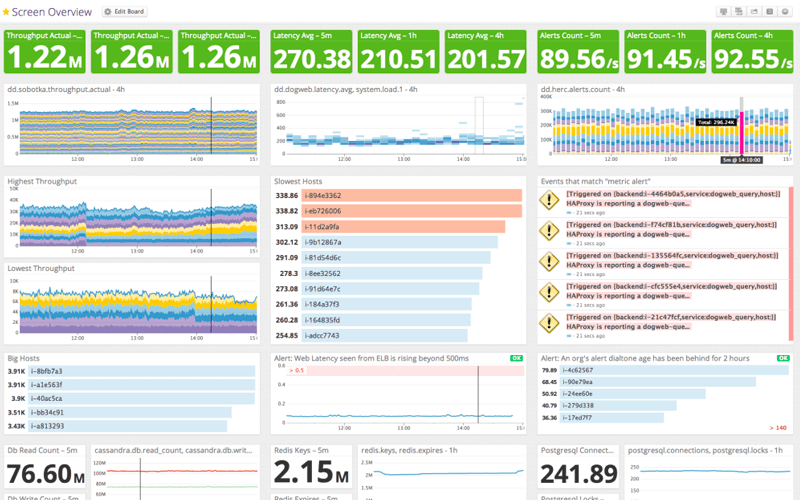
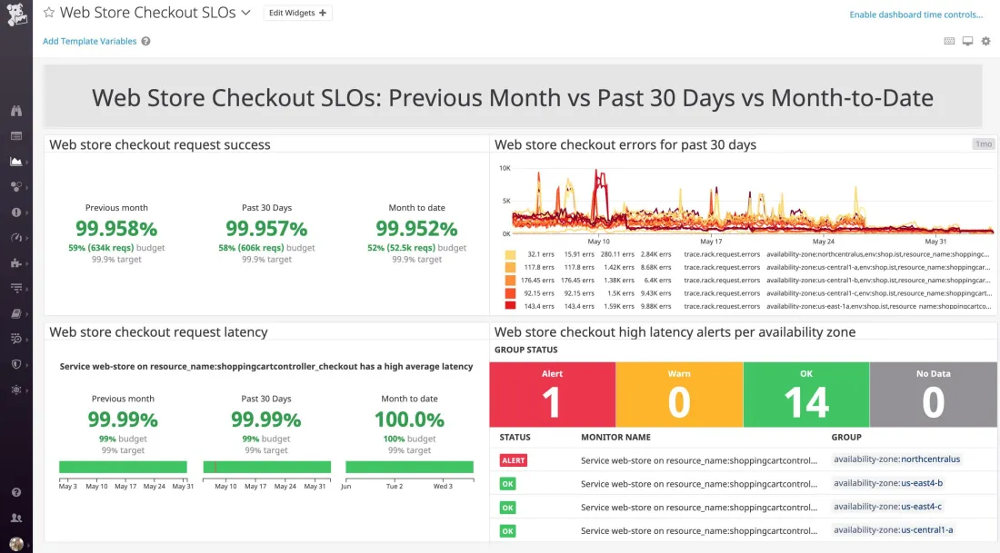

Si se trata de medir la fiabilidad del servicio, de comprender si está funcionando correctamente, podríamos argumentar que ya tenemos toda esa información en _dashboards_ con métricas de uso de CPU o de memoria, de usuarios conectados al servicio, latencias, etc… y sí, es cierto. Sin embargo, estos _dashboards_ tienen un problema: sin un conocimiento profundo del sistema, ¿te atreverías a asegurar si está funcionando correctamente basándote sólo en esta imágen?

Sin tener un conocimiento en detalle sobre el servicio es difícil decir si tener 2.15 millones de claves en Redis es o no un comportamiento normal, o cuáles serían las consecuencias de un valor anómalo. Sabemos que estamos leyendo 76.60 nillones de registros en los últimos cinco minutos de la base de datos, pero eso tampoco nos dice nada sobre la salud del servicio o cómo de saturado se encuentra. Y parece que ha crecido un poco el _throughput_ desde las 13:30 y que algo interesante ocurrió sobre las 12:15, pero ni idea de si está dentro de lo esperable. Tenemos algunos indicadores en verde en la parte superior, así que podemos imaginar que la cosa va bien, pero si estuvieran en rojo tampoco sabríamos cuál es el impacto sobre los usuarios o la gravedad de esa desviación, sólo que algo parece estar mal.

Los _Objetivos de Nivel de Servicio_ (Service Level Objectives, SLO) son la respuesta de [Site Reliability Engineering (SRE)]() a este problema.

## System metrics dashboard

El problema del _dashboard_ anterior es que no nos habla de la experiencia que los usuarios están teniendo: nos da un montón de detalles técnicos para cuya interpretación necesitamos conocer el servicio en profundidad.

Si tenemos configuradas alertas basadas en estas métricas es posible que recibamos alertas por un incremento del uso de CPU que puede ser normal bajo determinadas circunstancias. Pensemos en un proceso en lote que genera la facturación de la empresa a las tres de la mañana, cuando no hay tráfico en el sitio. Ese procesamiento supondrá un pico importante en el uso de CPU y memoria que alertará a quien esté de guardia, cuando en realidad ningún usuario se está viendo afectado por ese proceso que, además, finalizará en un par de horas volviendo al estado normal del sistema.

## Buscando un mejor dashboard

Veamos a continuación otro tipo de _dashboard_, y por qué es un poco mejor que el anterior.

En este _dashboard_ sabemos que estamos hablando del proceso de compra de un comercio. Y, fijándonos en el lado izquierdo, vemos también que el ratio de peticiones servidas correctamente y la latencia con la que estamos dando respuesta a los usuarios son correctas en su mayor parte. Además, bajo cada indicador, tenemos una estimación del ratio de error que asumimos como normal y que aún no hemos consumido. Incluso sin conocer el servicio, podemos asegurar que todo está funcionando bien y que si hubiera algún error aún estaría dentro del margen operativo normal. Y conoceríamos también la afectación a los usuarios: no están pudiendo completar la compra, o el proceso está siendo tan lento que podría hacer que decidieran llevarse su dinero a otra parte.

Si basamos nuestras alertas en este _dashboard_ despertaremos a quien esté de guardia a las tres de la mañana porque realmente tenemos un problema grave: los usuarios no pueden comprar, o la experiencia de compra que están teniendo es suficientemente frustrante para que decidan irse a otro lado.

**Este tipo de _dashboards_ de SLO no sustituyen a los anteriores**. Los _dashboards_ de objetivo de nivel de servicio nos hablan de los síntomas y cómo están afectando a los usuarios. Una vez que sabemos que la latencia está por encima del objetivo, podemos recurrir a _dashboards_ técnicos como el anterior para comprender las causas raíz de ese mal comportamiento del sistema.

## Indicadores, Objetivos, Acuerdos

### Indicadores de nivel de servicio (SLI)

Si vamos a establecer un objetivo, tenemos que tener un indicador para ese objetivo. Los indicadores de nivel de servicio (_Service Level Indicators, SLI_), son medidas cuantificables de la fiabilidad de una capacidad concreta de nuestro servicio. Los expresamos como el ratio entre eventos correctos frente a eventos válidos, resultando en un valor entre cero y uno.

$$
SLI = \frac{good}{valid}
$$

#### Especificación de indicadores

Qué es un evento válido depende de lo que estemos tratando de medir: si hablamos de la disponibilidad de un _endpoint_ API, un evento válido podría ser cualquier petición a un _endpoint_ existente con un método HTTP correcto. Y, con ese mismo ejemplo, un evento correcto podría ser una respuesta HTTP que no sea un error interno 5xx.

Usando estos valores obtenemos un ratio entre peticiones válidas a nuestra API y respuestas correctas a los clientes, que estará siempre entre cero (todos los eventos de respuesta han fallado, todo está caído) y uno (todos los eventos de respuesta han sido correctos, todo está funcionando perfectamente). Que todos los indicadores de la salud de nuestro servicio se encuentren en este rango nos hace más fácil razonar sobre ellos y nos permite automatizar algunas integraciones.

#### Implementación de indicadores

Si ya sabemos lo que queremos medir, a continuación tenemos que pensar en cómo medirlo: pasar de la especificación a la implementación. A la hora de medir esa latencia, ¿lo hacemos con la instrumentación que ya tenemos en la aplicación? ¿A través de las métricas del balanceador de carga? ¿En el dispositivo del cliente?

Cada una de estas aproximaciones tiene ventajas y desventajas: cuanto más nos alejamos del usuario menos precisas son nuestras métricas, pero resulta algo más sencillo implementarlas. Por otro lado, si nos vamos demasiado cerca del usuario tendremos la mejor precisión, pero estaremos introduciendo otras consideraciones para las que es posible que no podamos hacer nada (disponibilidad o latencia de la red del operador del cliente, por ejemplo). Algunas implementaciones pueden además dar una falsa sensación de seguridad: puede que todo esté correcto a nivel de aplicación, pero nuestro balanceador de carga esté caído y el cliente no esté viendo nada.

Podemos establecer varias implementaciones para una misma especificación de SLI para intentar equilibrar la balanza y definir así un SLI compuesto:

- % de peticiones válidas servidas en menos de 100ms, medidas en la aplicación
- % de peticiones válidas servidas en menos de 150ms, medidas en el balanceador de carga

¿De dónde hemos sacado esos 100/150ms? De nuestro conocimiento previo sobre el servicio o sobre la satisfacción de nuestros usuarios, o de nuestra aspiración. Revisaremos nuestros SLI con el tiempo, por lo que no importa tanto no acertar a la primera como tener un punto de partida.

#### Categorías de indicadores

Pensar en cuáles son los SLI a los que queremos prestar atención es complicado, pero podemos definir algunas categorías que nos ayuden a pensar en ello.

- **Petición/Respuesta**
  - **Disponibilidad**: % de peticiones válidas servidas correctamente
  - **Latencia**: % de peticiones válidas servidas en menos de X tiempo
  - **Calidad**: % de peticiones válidas servidas sin degradar la respuesta

- **Datos**
  - **Cobertura**: % de datos válidos procesados correctamente
  - **Frescura**: % de datos válidos procesados más recientemente que X tiempo
  - **Corrección**: % de datos válidos que han producido el resultado correcto
  
- **Almacenamiento**
  - **Durabilidad**: % de datos escritos que pueden ser leídos correctamente

Algunas de estas categorías pueden ser especialmente difíciles de definir, como la corrección, otras son por lo general mucho más fáciles de determinar como la disponibilidad y la latencia. Como consejo general si empezáis a aplicar SLOs, empezad por los más sencillos hasta que tengáis suficiente soltura para complicaros la vida. Os evitaréis mucha frustración y podréis empezar a ver resultados antes.

Aseguraos de contar siempre con la participación del responsable de producto en la definición de SLI, porque estos deberían ser medidores razonables de la satisfacción de nuestros usuarios.

### Objetivos de nivel de servicio (SLO)

Una vez que conocemos los indicadores que vamos a usar, es hora de fijar un objetivo de fiabilidad para ellos. Definimos un SLO, _Service Level Objective_, como el objetivo para los indicadores definidos agregados a lo largo de una ventana deslizante de tiempo.
 
- **SLI**: % peticiones válidas servidas en menos de 100ms, medidas en el load balancer.
- **SLO**: 99.5% peticiones válidas servidas en menos de 100ms, medidas en el load balancer, en una ventana deslizante de 30 días.

El objetivo que fijemos se basa en nuestra experiencia pasada con el servicio o lo que conocemos sobre el límite de satisfacción de nuestros usuarios, balanceado con el coste y esfuerzo que supone alcanzar ese objetivo.

¿Por qué no fijar un objetivo del 100%? ¿No sería lo ideal? Pues el hecho es que no: **100% es el objetivo incorrecto de fiabilidad para prácticamente cualquier cosa**.

Valores mayores de fiabilidad suponen invertir más en infraestructura, replicar sistemas, destinar más recursos a la resolución rápida de incidencias… el coste y esfuerzo crecen de manera exponencial con la fiabilidad. Por otro lado, la inmensa mayoría de nuestros usuarios no apreciarán una diferencia entre el 99.9% y el 99.99% de fiabilidad. **Nos interesa ser tan fiables como sea necesario, pero no más.**

Al igual que con los SLI, debemos involucrar a la gente de producto en esta decisión: los objetivos fijados giran entorno a la satisfacción de los usuarios, y las conclusiones a las que lleguemos constituirán un acuerdo de equipo para el que queremos tener un consenso claro.

### Acuerdos de nivel de servicio (SLA)

Un SLA, _Service Level Agreement_, es un acuerdo con nuestros usuarios sobre el nivel servicio que nos comprometemos a cumplir, y las consecuencias que tendrá incumplir este límite.

Los SLO nos sirven para razonar sobre la salud del sistema, son un compromiso interno de fiabilidad. Si fallamos en su cumplimiento revaluamos nuestro trabajo para dedicar más esfuerzo a la fiabilidad. Los SLA, en cambio, son un compromiso externo: si fallamos en su cumplimiento podemos enfrentar consecuencias legales, compensaciones económicas o de algún otro tipo.

No resulta muy difícil imaginar por qué los SLO deberían ser siempre más restrictivos que los SLA: queremos que nuestro sistema nos advierta de cualquier problema de fiabilidad antes de que lleguemos a poner en peligro el acuerdo de nivel servicio pactado con nuestros usuarios.

- SLI: % peticiones válidas servidas en menos de 100ms, medidas en el load balancer.
- SLO: 99.5% peticiones válidas servidas en menos de 100ms, medidas en el load balancer, en una ventana deslizante de 30 días.
- SLA: 99% peticiones válidas servidas en menos de 100ms, medidas en el load balancer, en una ventana deslizante de 30 días. En caso de incumplimiento, se compensará con créditos de servicio.

## Son los usuarios, amigo

Todo en SRE gira entorno a los usuarios y su satisfacción con el uso de nuestro servicio. Los _Service Level Indicator_ (SLI) que fijemos deben medir de forma razonable esta satisfacción. Los _Service Level Objective_ (SLO) que marquemos suponen la diferencia entre tener usuarios felices con el comportamiento del servicio a decepcionarles entregando una calidad de servicio insuficiente. Y si continuamos degradando la fiabilidad, acabaremos con usuarios cabreados al superar el límite fijado por nuestro _Service Level Agreement_ (SLA), y potencialmente enfrentándonos a consecuencias legales o compensaciones de cualquier tipo.

### Satisfacción de los usuarios y fiabilidad

Por esto es tan importante tener siempre en mente la experiencia de usuario y contar con la participación de quienes toman más responsabilidad en el enlace con ellos, los responsables de producto.

Si decimos que el objetivo no es no tener nunca caídas de servicio si no maximizar la velocidad de desarrollo dentro de los límites de error establecidos, ¿cómo definimos este presupuesto de error? ¡Lo veremos en el siguiente artículo!