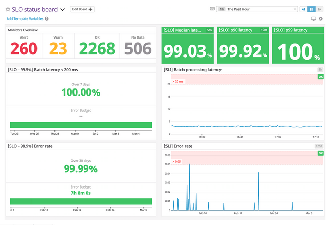
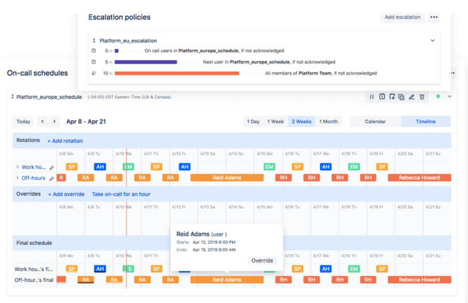
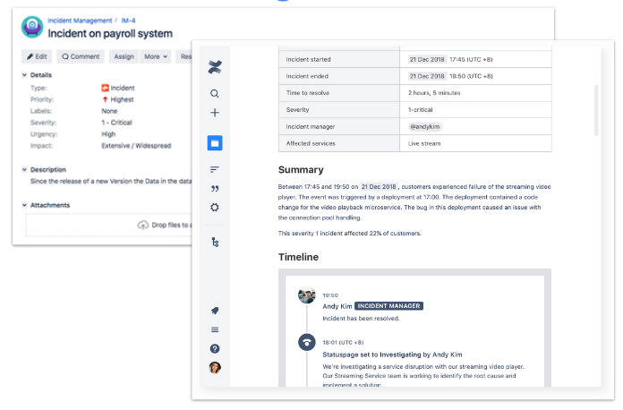
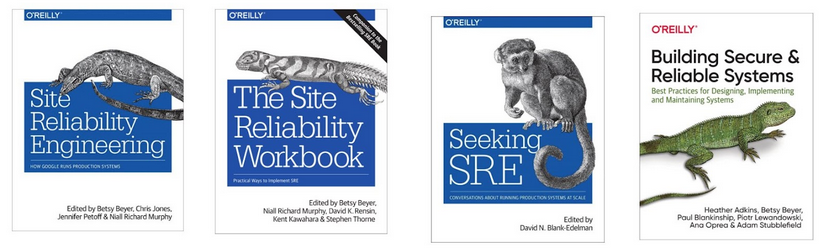

Una vez vista la introducción a [Site Reliability Engineering (SRE)]() y los conceptos de [niveles de servicio SLI, SLO y SLA](), la última pieza del puzle es el _Error Budget_ o margen de error.

El _Error Budget_ es un mecanismo de control que determina cuándo es el momento de enfocarnos en mejorar la fiabilidad del sitio. A través de los indicadores de nivel de servicio hemos acordado unos límites de fiabilidad que consideramos razonables para mantener la satisfacción de los usuarios. Al hacerlo, implícitamente hemos determinado el nivel de fallo que estamos dispuestos a admitir como normal, sin consecuencias en el desarrollo. Si traspasamos este límite, es el momento de revisar cómo podemos volver a los niveles de fiabilidad acordados.

Quizá incluso más importante: haber acordado un límite de fiabilidad nos da margen para innovar, experimentar, incrementar la velocidad de desarrollo y asumir riesgos. **El objetivo no es no tener fallos en el servicio, el objetivos es conseguir la máxima velocidad de desarrollo dentro de unos márgenes de fiabilidad definidos en el presupuesto de error**.

Definimos el presupuesto de error como la inversa del objetivo de nivel de servicio (SLO):

$$
ErrorBudget = 1 - SLO
$$

## Tan confiable como sea necesario, pero no más

El motivo por el que niveles de servicio del 100% son indeseables en casi todos los escenarios es porque el esfuerzo y coste crece exponencialmente a medida que incrementamos el nivel de servicio, mientras que la mayoría de los usuarios no van a percibir una mejora sustancial entre el 99.9% y el 100% de fiabilidad. Además, un nivel de servicio del 100% nos deja sin ningún margen de operación para asumir riesgos, para innovar y experimentar.

Tanto es así que, en ocasiones, puede resultar conveniente quemar nuestro presupuesto de error intencionalmente, asegurándonos de que nuestros usuarios no dependen de un nivel de fiabilidad mayor del que hemos determinado.



¿Y si los usuarios se quejan si hacemos esto? ¿Y si no se quejan? En cualquiera de los dos casos, habremos aprendido algo sobre el nivel de fiabilidad que esperan, y podremos revisar y ajustar nuestro compromiso de fiabilidad para mantener la satisfacción de los usuarios a la vez que preservamos nuestra capacidad de incrementar la velocidad de desarrollo, de innovar y experimentar.

|  Nivel de fiabilidad | : Ventana de error :                       |||
|                 ^^   | por año      | por trimestre | por 30 días   |
----------------------:|-------------:|--------------:|--------------:|
| 90%                  | 36.5 días    | 9 días        | 3 días        |
| 95%                  | 18.25 días   | 4.5 días      | 1.5 días      |
| 99%                  | 3.65 días    | 21.6 horas    | 7.2 horas     |
| 99.5%                | 1.83 días    | 10.8 horas    | 3.6 horas     |
| 99.9%                | 8.76 horas   | 2.16 horas    | 43.2 minutos  |
| 99.95%               | 4.38 horas   | 1.08 horas    | 21.6 minutos  |
| 99.99%               | 52.6 minutos | 12.96 minutos | 4.32 minutos  |
| 99.999%              | 5.26 minutos | 1.30 minutos  | 25.9 segundos |

## Política de margen de error

La política de margen de error (_Error Budget Policy_) es un acuerdo de equipo que determina cómo vamos a actuar cuando nuestro margen de error se reduce o se agota por completo. Debe ser un acuerdo entre todas las partes implicadas, incluyendo responsables de producto, desarrolladores, gestores...

Es un acuerdo _constructivo_: no se trata de penalizar el fallo, si no de establecer unas bases comunes que determinan cómo actuamos como equipo en estos escenarios. *Detener el desarrollo no es deseable*, esta política da al equipo la capacidad de enfocarse exclusivamente en la fiabilidad cuando los datos muestran que es más importante que el desarrollo de nuevas características de producto.

La política de margen de error debería incluir, al menos, lo siguientes aspectos:

- Política de SLO fallido _(SLO miss policy)_

> - "**Debemos** trabajar en la fiabilidad del producto si..."
> - "**Podemos** continuar el trabajo en nuevas características de producto si..."

- Política de corte _(outage policy)_

> "Si una única clase de fallo consume más de nuestro 20% de margen de error durante un ciclo, **debemos** incluir como objetivo corregir este fallo durante el próximo ciclo"

- Política de escalado _(escalation policy)_

> "En caso de desacuerdo, **podemos** (_should_) elevar la cuestión al jefe de ingeniería para la toma de una decisión."

- Política de revisión

> "*Podemos* revisar esta política en cada cierre de ciclo para adaptarla a lo que hemos descubierto durante este tiempo."

Es importante hacer notar que en esta política utilizamos `podemos` y `debemos` de forma muy intencional, siguiendo los niveles de requerimiento definidos por el [RFC-2119 en su versión española](https://www.rfc-es.org/rfc/rfc2119-es.txt).

## Vale, ¿por dónde empezamos?

Hemos visto [qué es SRE](), hemos dado un repaso a la [definición de niveles de servicio]() y hemos visto qué es el margen de error y cómo se relaciona con los niveles de servicio y con nuestra capacidad para innovar, experimentar y asumir riesgos, mientras mantenemos la satisfacción de nuestros usuarios. Si nos planteamos poner esto en práctica, ¿por dónde empezamos?

- Elegir un único servicio que pasaremos a regir mediante el modelo SRE
- Proporcionar al equipo responsable del servicio el soporte ejecutivo necesario
- Garantizar un entorno seguro al equipo, que fomente una cultura de aprendizaje y descubrimiento
- *Definir los SLOs* y medir frecuentemente la salud del equipo
- Fomentar un progreso gradual e iterativo que libere la capacidad del equipo de continuar progresando
- Una vez formado un caso de éxito, compartirlo con otros equipos de la empresa

Durante todo este proceso, es importante recordar que la automatización y el trabajo en operabilidad permite escalar los sistemas de la empresa sin escalar la organización, que debemos trabajar en reducir la tensión entre desarrollo y operaciones, y que nuestro margen de error acordado y la política asociada a él nos proporcionan la flexibilidad de trabajar en desarollo de nuevas características y en fiabilidad bajo un criterio sólido.

### Definir nuestro primer SLO

Una aproximación sistemática a la definición de nuestros SLOs nos ayudará a definirlos de forma estructurada y razonada. Cualquier proceso que sirva a nuestro equipo es bueno, el siguiente es un ejemplo a modo de receta de cómo podemos llegar a la definición del primer SLO:

1. Elegir un servicio concreto.
2. Comprender cuáles son los usuarios (personas u otros servicios) que utilizan este servicio.
3. Para un tipo concreto de usuario y si caso de uso principal en el servicio:
    1. ¿Qué garantías les gustaría tener sobre el servicio?
    2. ¿Qué garantías _creen tener_ pero no tienen?
    3. ¿ Que les hace estar satisfechos o insatisfechos con el servicio?
4. Elegir **una única cosa** a medir y cómo medirla (SLI)
5. Establecer un objetivo basado en la experiencia o en la mejor estimación (SLO)
6. Asegurar que el margen de error resultante es aceptado como normal por todos los implicados (producto, desarrollo, gestión...)
7. Definir las acciones que tomaremos si fallamos en este objetivo de nivel de servicio (Política de margen de error)
8. **Iterar, refinar y extender**

Los usuarios suelen tener expectativas poco realistas sobre la fiabilidad del servicio, por lo que es importante que en este proceso tengamos en mente qué es aceptable para ellos, y no lo que consideran ideal.

## Siguientes pasos

Una vez hemos definido nuestros niveles de servicio y márgenes de error, y hemos empezado a utilizarlos de forma contínua en el día a día del servicio, podemos empezar a pensar en visibilizar los datos mediante diferentes integraciones con herramientas de terceros, y automatizar procesos basados en los datos de fiabilidad que estamos obteniendo.

Algunos ejemplos de esto son los [_dashboards_ SLO de Datadog](https://www.datadoghq.com/dg/enterprise/slo-monitoring/) o la [monitorización SLO de Dynatrace](https://www.dynatrace.com/support/help/how-to-use-dynatrace/cloud-automation/service-level-objectives/configure-and-monitor-slo). A partir de la integración con estas herramientas, podemos continuar el proceso de automatización con la integración con herramientas de gestión de alertas como [OpsGenie](https://www.atlassian.com/software/opsgenie/what-is-opsgenie) y su integración con [Jira](https://www.atlassian.com/software/jira) para la generación automática de tickets de incidencia y reportes de post-incidencia, o integrar OpsGenie con [Slack](https://slack.com/intl/es-es) para la comunicación de incidencias a los equipos.

Por supuesto, podemos extender esta automatización tanto como queramos a través de otras integraciones con terceros o de nuestras propias [_funciones lambda_ en AWS](https://aws.amazon.com/lambda/), por ejemplo.

Si queréis continuar investigando sobre el tema, podéis echar un vistazo en el [microsite de Google sobre SRE](https://sre.google/), o echar un vistazo a alguno de los siguientes libros.

