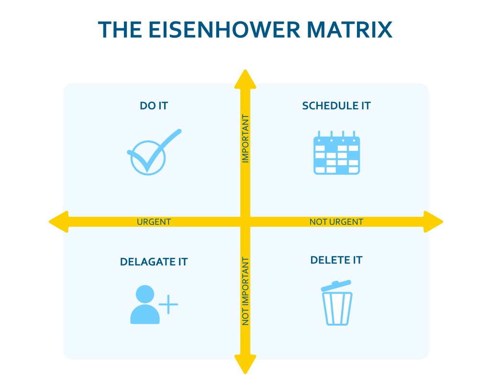

Si hay una metodología mistificada hasta el absurdo esa es probablemente _Objectives and Key Results_ (OKR). El concepto es sumamamente sencillo y, sin embargo, la tendencia innata a creer que algo que no conocemos debe ser complejo a la fuerza hace que su adopción resulte un tanto tortuosa. Hasta que, finalmente y a través de la experiencia, comprobamos que no era tan fiera la bestia. Objetivos y resultados clave: qué queremos y cómo vamos a medir si estamos consiguiéndolo. A esto le sumamos las iniciativas: qué vamos a hacer para intentar conseguir ese objetivo. ¿Cuánto podemos complicar algo tan simple?

_Objectives and Key Results (OKR)_ es una metodología de trabajo que permite a las organizaciones diseñar y ejecutar una estrategia, poniendo el foco en lo que realmente importa para conseguir sus objetivos de modo transparente y mejorando la alineación de toda la organización.

Parte del problema de OKR es que ya desde sus siglas obviamos una parte importante de la metodología, generando cierta confusión. Desde el podio de mi teclado, OKRi siempre me ha parecido un nombre ligeramente mejor: _Objetives, Key Results **and Initiatives**_. Un OKR consiste en un **objetivo**, qué queremos conseguir, varios **resultados clave**, los resultados que necesitamos para conseguirlo, e **iniciativas**, las acciones que vamos a tomar que nos ayudarán a cumplir los resultados clave. La metodología incluye unas reglas básicas que ayudan a priorizar, alinear y medir los resultados.

## Objetivos, resultados clave e iniciativas

### Objetivo
Un objetivo es algo que queremos conseguir en el futuro, una meta aspiracional de alto impacto, definida en el tiempo, comprensible y asumible para todas las partes. Nos indica a dónde queremos llegar, cuál es nuestra meta y por qué hacemos lo que hacemos.

Algunos ejemplos de objetivos podrían ser:

- Convertirnos en _Best Place to Work_ en 2023.
- Optimizar el beneficio los productos principales.
- Ser la marca de referencia en nuestro mercado.

Todos estos objetivos están demarcados en el tiempo, y deben estar en nuestro círculo de influencia para poder ser realistas. Si nuestros objetivos dependen de terceros y no podemos influir en ellos dificilmente serán conseguibles hagamos lo que hagamos.

### Resultado clave
Un resultado clave es una medida que nos permite cuantificar la progresión hacia el objetivo, parte de un valor inicial y tiene un valor deseable de destino. Debe ser ambicioso, de alto impacto, concreto y limitado en el tiempo. Un objetivo está relacionado con uno o más resultados clave que contribuyen a su consecución.

Algunos ejemplos de resultados clave podría ser:

- Incrementar el [NPS](https://es.wikipedia.org/wiki/Net_Promoter_Score) de los empleados de la empresa en dos puntos.
- Reducir el coste de manipulación de los productos principales en un 20%.
- Adquirir dos competidores pequeños de nuestro mercado.

Estos resultados clave están demarcados en el tiempo, y deben estar en nuestro círculo de influencia. Un ejemplo clásico es que nuestros KR dependan del trabajo de otros sobre los que no tenemos ninguna influencia en sus prioridades. Podemos pensar en algunas iniciativas que nos ayuden a mejorar el bienestar de nuestros emnpleados y su satisfacción con la empresa, que nos ayuden a reducir los costes de manipulación, e incluso que puedan convencer a competidores para su absorción. Pero poco podemos hacer desde nuestro escritorio para que, por ejemplo, el mercado global de vehículos usados reduzca el coste medio en un 10% y eso nos permita incrementar nuestro beneficio. Sencillamente, no está en nuestra mano.

Ese último ejemplo, llevado intencionalmente al absurdo, es uno de los problemas más habituales en la defición de nuestros KR. Podemos definir KR que dependan del trabajo de otros equipos siempre y cuando tengamos alguna influencia en esos equipos y sus prioridades. Incluso podríamos pensar en un KR consistente en incrementar la influencia que tenemos sobre las decisiones de otros equipos. Pero definir un KR sobre el que no tenemos ninguna influencia es una llamada al fracaso.

Los resultados clave tienen, como ya hemos dicho, un punto de partida y un destino. En los ejemplos anteriores estos están definidos de forma implícita: incrementar en dos puntos el NPS supone pasar de un NPS de 6,5 hoy a uno de 8,5 a cierre de ciclo. Reducir el coste de manipulación en un 20% supone pasar del coste actual medio de 10&euro; a uno de 8&euro; al cierre de ciclo. Adquirir dos competidores es pasar de cero competidor adquiridos a día de hoy, a dos competidores adquiridos a cierre de ciclo. En cualquier momento durante el ciclo podemos mirar a estos indicadores para saber cómo estamos progresando.

Habitualmente se desaconseja pensar en KR binarios: o hemos conseguido algo o no lo hemos conseguido, sin puntos intermedios. Un buen ejemplo de esto sería un KR del tipo _"Poner el producción el sistema de cupones de descuento"_. El problema de un KR como este es que no nos permite medir durante el ciclo si nos estamos acercando a la consecución del resultado o si, por el contrario, va a fracasar estrepitosamente. No nos permite reaccionar a tiempo, sólo podemos esperar que consigamos cumplirlo sin ningún modo de saber si estamos más o menos cerca de ello.

Una forma de contrarestar esto podría ser pensar en ese KR de forma más iterativa. El desarrollo de el sistema de cupones no es necesariamente un todo o nada: podemos empezar implementando un MVP limitado a un segmento muy concreto de clientes que tolerarán mejor un sistema más manual, y refinarlo progresivamente aumentando el número de clientes a los que ofrecemos esta característica. Así, podríamos redefinir ese KR como _"El sistema de cupones está disponible para el 60% de los usuarios"_.

### Iniciativas
Para mi el gran olvidado de OKR, lo que hace que a veces confundamos resultados clave con acciones concretas. Las iniciativas son todos los proyectos y tareas que nos ayudan a conseguir un resultado clave, que a su vez contribuye a la consecución un objetivo. Si pensamos en un objetivo como _"Convertirnos en propietarios de una vivienda"_, un posible resultado clave sería _"Ahorrar 30.000&euro; para la entrada"_. Podemos medir cómo lo estamos haciendo a lo largo del año echando un vistazo a nuestra cuenta bancaria. Algunas **iniciativas** en las que podríamos pensar para contribuir a ese resultado clave son incrementar nuestros ingresos dando clases particulares o buscando un segundo trabajo por horas, vender cosas que no usamos, priorizar las cenas en casa con amigos frente a las salidas a restaurantes y bares, hacer viajes más modestos en vacaciones, reciclar, reducir y reutilizar...

Las iniciativas deben estar en nuestro círculo de influencia, ser medibles, específicas y delimitadas en el tiempo. Podemos pensar en las iniciativas como hipótesis de qué tareas o proyectos creemos que contribuirán a los resultados clave. Cuando revisemos nuestros OKR, **algo que debemos hacer con una frecuencia establecida**, decidiremos si estas hipótesis se están cumpliendo o, por el contrario, debemos plantearnos cancelar o pivotar algunas iniciativas.

Algunos ejemplos de iniciativas para los KR que hemos propuesto anteriormente podrían ser:

- Contratar a un responsable de cultura organizacional
- Agrupar envíos en función de destino
- Asegurar fondos para la adquisición

### TL;DR

> - **Objetivo**: Dónde queremos llegar
> - **Key Result**: Cómo medimos si estamos progresando hacia el objetivo
> - **Iniciativa**: Qué vamos a hacer para progresar

Objetivos, resultados clave e iniciativas deben estar en nuestro círculo de influencia y tener una delimitación temporal clara. Los objetivos deben ser aspiracionales y de alto impacto. Los resultados clave deben ser ambiciosos, específicos y cuantificables para permitirnos medir el progreso. Las iniciativas deben estar bajo nuestro control y contribuir al resultado clave.

Ejemplo:
> - **Objetivo 1**: Posicionarnos como la marca de referencia en el sector
>   - **Resultado clave 1.1**: Incrementar las recomendaciones en un 20%
>     - **Iniciativa 1.1.1**: incentivar la recomendación mediante descuentos
>     - **Iniciativa 1.1.2**: organizar sorteos mensuales en redes sociales
>   - **Resultado clave 1.2**: Adquirir dos pequeños competidores
>     - **Iniciativa 1.2.1**: asegurar fondos para la adquisición
>     - **Iniciativa 1.2.2**: identificar competidores candidatos
> - **Objetivo 2**: Optimizar el beneficio en los productos principales
>   - **Resultado clave 2.1**: reducir el coste de manipulación en un 20%
>     - **Iniciativa 2.1.1**: agrupar envíos 

## Jerarquía de OKRs

Un punto de fricción habitual es quién, cuándo y cómo define los OKR y sus iniciativas relacionadas. Los OKR principales parten de la organización, y dan dirección a toda la empresa respecto a los objetivos comunes. Normalmente tienen un ciclo más largo, que puede ser de entre uno y cinco años, y reflejan las tres o cuatro cosas que la empresa decide que debe conseguir como objetivos en este periodo.

Idealmente todos los responsables implicados deben colaborar en los OKR organizacionales para facilitar la alineación y contribución de todas las partes, y asegurar que se tiene en cuenta la estrategia de la empresa para este ciclo y todas las iniciativas que pueden contribuir a su consecución.

Una vez definidos los OKR organizacionales, de caracter más estratégico, los equipos pueden definir sus propios OKR con un espíritu más táctico y un ciclo reducido. Si los OKR organizacionales suelen tener una duración de uno o varios años, los OKR de equipo suelen tener una duración de un trimestre. La clave de los OKR de equipo debe estar en asegurar su alineación con los OKR organizacionales, pero los equipos deben contar con suficiente autonomía para poder proponer sus propios objetivos, resultados clave e iniciativas por sí mismos. Esto no sólo facilita el proceso, si no que asegura que el equipo pueda sentirse dueño y responsable de sus OKR.

Hay un tercer nivel de OKR que podemos considerar, los OKR personales. En [Thoughtworks](https://www.thoughtworks.com/es-es) cada consultor tiene un ciclo de desempeño personal guiado por un _performance partner_, generalmente otro _thoughtworker_ con algo más de experiencia que nos ayuda a definir nuestros objetivos profesionales y plan de carrera y con el que hacemos _check-ins_ regularmente para comentar cómo nos va en el proyecto actual, si hay algo que nos preocupa o alguna oportunidad que creemos que puede ser interesante y cómo nos puede ayudar. Con nuestro _performance partner_ definimos objetivos para los siguientes meses, y al cierre del ciclo y después de los _check-ins_ intermedios recopilamos el _feedback_ de nuestros compañeros y del cliente y hacemos una revisión del ciclo. Este proceso no está necesariamente guiado por OKR, pero en mi propia revisión y como _performance partner_ esta suele ser mi recomendación: usar OKR personales ayuda a pensar en nuestros objetivos de forma estructurada, a hacer un seguimiento certero de los resultados clave basado en datos, y a definir inicitivas que creemos que pueden ayudarnos a conseguir esos resultados.

## OKR y prioridad

> _"Tengo dos tipos de problemas: urgentes e importantes. Los urgentes normalmente no son importantes, y los importantes casi nunca son urgentes."_
> Dwight D. Eisenhower

El método Eisenhower consiste en decidir si algo debería ser una prioridad basándose en estos dos ejes: si es importante y urgente, debe hacerse prioritariamente. Si no es urgente ni importante, debe posponerse.

Definir tus OKR sirve de guía para discernir qué es o no prioritario, qué es importante y urgente. Si quieres justificar por qué un objetivo es prioritario, piensa en por qué es importante o urgente. La respuesta a estas preguntas ayudan a la organización a entender por qué estamos trabajando en un objetivo concreto.

Es inevitable que surjan imprevistos durante un ciclo que nos hagan reconsiderar nuestras prioridades, quizá algunas iniciativas no están contribuyendo en la medida de lo que esperábamos a conseguir nuestros resultados clave. O puede que una nueva legislación, un problema de seguridad o una oportunidad con una ventana muy corta de ejecución nos hagan replantearnos el trabajo del ciclo. Pero conviene recordar que si hemos definido estos OKR, y no otros, es porque creemos en su importancia y urgencia por el valor que aportan al negocio. En palabras de Steve Jobs, _"Focusing is about saying no"_. 

## OKR y KPI

Ahora que sabes de qué va esto de los OKR, quizá te preguntes qué diferencia hay con los [Indicadores Clave de Rendimiento (KPI)](https://es.wikipedia.org/wiki/Indicador_clave_de_rendimiento) y si deberías usar unos u otros.

La realidad es que KPIs y OKRs funcionan perfectamente juntos. Mientras que los KPI son indicadores clave de negocio que miden la salud y el éxito de la organización o el equipo, y que generalmente tienen una vigencia permanente, los OKR son indicadores de plazo medio sobre objetivos concretos.

Volviendo la los ejemplos anteriores, seguramente queremos mantener la satisfacción de nuestros empleados como un KPI de la organización, un indicador permanente de la salud de la empresa. A medio plazo, podemos definir un objetivo como "Convertirnos en _Best Place to Work_ en 2023", un resultado clave como "Incrementar el NPS de la plantilla en 2 puntos", iniciativas como "Contratar un responsable de cultura organizacional"... el cumplimiento de este OKR debería verse reflejado en el KPI.

## OKR de negocio y OKR técnicos

Si me seguís en [Mastodon](https://mastodon.green/@gorka) o [Twitter](https://twitter.com/gorkaio) estaréis hartos de oírmelo decir: **no existen los objetivos técnicos como algo independiente de negocio**.

Suele haber cierta fricción entre los equipos técnicos y los representantes de negocio cuando se trata de priorizar tareas como la actualización de librerías o imágenes docker, dedicar tiempo a mejorar el rendimiento de nuestras _pipelines_ o implementar CICD en nuestros servicios. Negocio suele ver esto como trabajo puramente técnico, mientras que el equipo técnico a veces no encuentra el modo de articular en lenguaje de negocio por qué este trabajo es importante o urgente.

Cuando un equipo técnico trabaja en implementar CICD, mejorar el rendimiento de las _pipelines_,... lo hace porque negocio tiene como objetivo reducir el tiempo que cuesta poner nuevas características a disposición de sus clientes, reaccionar de forma más ágil a cambios en el mercado, o propocionar una experiencia de uso más efectiva y consistente a sus usuarios. Cuando se trabaja en actualizar dependencias o mejorar la seguridad, se hace porque negocio tiene como objetivo asegurar la fiabilidad y seguridad de sus datos y los de sus clientes. No es que a los desarrolladores nos guste dedicarnos a nuestros cacharros (que también...). A veces, sin embargo, esto no se articula de un modo que negocio pueda comprender, compartir y apoyar.

Pero ojo, a veces cosas que desde el punto de vista técnico nos parecen imprescindibles no tienen un impacto claro en negocio, o sencillamente no están entre las prioridades inmediatas para la organización. Y esto también es algo válido. Es lo que habitualmente llamamos deuda técnica. Pero esa es otra historia y debe ser contada en otra ocasión.