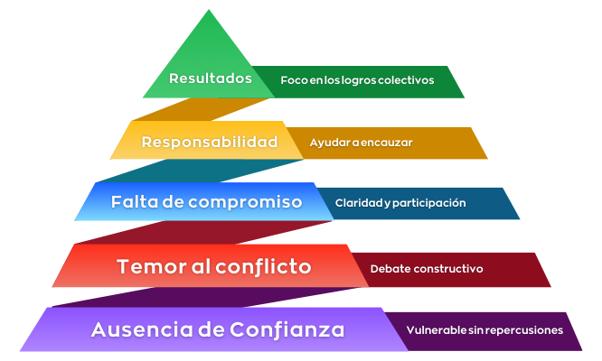

He tenido ["Las cinco disfunciones de un equipo"](https://www.amazon.es/cinco-disfunciones-equipo-Narrativa-empresarial-ebook/dp/B01MDV4JPK) enterrado en la lista de libros pendientes durante muchos meses. A priori, la lectura de un libro sobre gestión de equipos no me resultaba muy apetecible. Sin embargo, [Patrick Lencioni](https://es.wikipedia.org/wiki/Patrick_Lencioni) engancha con una narrativa que huye del aleccionamiento académico: en este libro, pasan cosas. Cualquiera que haya trabajado en equipo, sin necesidad de haber liderado o gestionado equipos antes, se identificará con algunos pasajes. En este artículo veremos el primer pilar de estas disfunciones, la ausencia de confianza.

Kathryn Petersen es contratada como Directora General de una empresa que pasa por algunos dificultades en el mercado, pese a tener una posición a priori dominante sobre su competencia. La empresa cuenta con un equipo directivo experimentado y capaz, con una amplia influencia en el mercado y una cómoda situación financiera, y a pesar de todo la competencia les supera día a día en ingresos y en número de clientes. ¿Cómo es posible? A través de este planteamiento narrativo Lencioni introduce cinco disfunciones habituales en los equipos de cualquier empresa, aportando algunos indicadores y técnicas para transformarlos equipos de alto rendimiento.

## Ausencia de confianza

La primera disfunción es la ausencia de confianza, entendida como la seguridad en que las intenciones de cada persona del equipo son buenas y no hay razón para ser protector ni cauteloso en el grupo. Cuando evitamos mostrarnos vulnerables hacia los demás, sin reconocer nuestros errores y debilidades, minamos la base de esta confianza. Sólo cuando los miembros de un equipo pueden actuar sin preocuparse de protegerse a sí mismos dejan de actuar por estrategia o por mantener cuotas de poder, y empiezan a asumir riesgos pidiendo u ofreciendo ayuda.

### Indicadores

Los miembros de equipos donde falta confianza desperdician mucho tiempo y esfuerzo en controlar su conducta e interacciones con el grupo, llegan a conclusiones acerca de las intenciones o aptitudes de otros sin tratar de aclararlas, ocultan los resentimientos, temen la exposición al grupo que suponen las reuniones y son reticentes a pedir u ofrecer ayuda. La moral es habitualmente muy baja y son frecuentes las renuncias o cambios de personal.

### Herramientas

Contruir esta confianza requiere compartir experiencias, construir una credibilidad basada en la vulnerabilidad y comprender los atributos únicos de cada miembro del equipo.

#### Historias personales

Reunir a los miembros del equipo y proponerles que contesten a una breve lista de preguntas sobre sí mismos. Las preguntas no deben ser demasiado sensibles, y pueden ser cosas como su ciudad natal, el número de hermanos que tienen, mascotas, aficiones, primer trabajo... el objetivo es que comiencen a relacionarse sobre una base más personal, y se vean unos a otros como seres humanos con historias y antecedentes interesantes.

#### Dos verdades y una mentira

Este ejercio no lo propone Lencioni, pero en mi opinión suele resultar más dinámico y divertido que el anterior, y da la oportunidad de que cada persona comparta cosas que son relevantes para ella en su vida personal sin revelar datos que, por cualquier motivo, no se sienta cómodo compartiendo.

Cada miembro del equipo debe pensar un hecho real y dos falsos sobre sí mismo que el resto desconozcan. Expondrá al equipo estos tres hechos, y cada uno tendrá que intentar adivinar cuál de ellos es verdad y cuáles son mentira.

#### Ejercicio de feedback

Lencioni propone un ejercicio en el que cada miembro del equipo identifica la aportación más importante que cada uno de sus colegas hace al conjunto, y también el área que podrían mejorar o aquellas acciones o actitudes que sería mejor eliminar. Estas respuestas se comparten en grupo después, centrándose en una persona cada vez y empezando habitualmente por el líder del equipo.

Personalmente no me convence esta propuesta de Lencioni por la confrontación pública que fuerza en un estadio de baja confianza en el equipo, y optaría por un ejercicio de [speedback](https://www.thoughtworks.com/en-us/insights/blog/what-speedback-and-how-run-it-using-zoom-breakout-rooms) que puede sentar las bases de la confianza evitando confrontaciones públicas, que pueden derivar en enfrentamientos personales.

#### Perfiles de personalidad y preferencia de conducta

Cada mienbro del equipo completa un cuestionario como el [Myers-Briggs Type Indicator (MBTI)](https://en.wikipedia.org/wiki/Myers%E2%80%93Briggs_Type_Indicator) y comparte los resultados con el resto. Este tipo de cuestionarios identifican los rasgos más destacables de personalidad y estilo de comunicación de cada persona, de modo que las personas del equipo se comprendan mejor entre ellas y simpaticen entre sí.

Ya, yo tampoco creo en el Horóscopo ni en los cuestionaros de Vale, pero si te tomas el tiempo de probar estos perfiles de personalidad puede que te sorprenda cómo reflejan tu estilo personal.

#### Evaluaciones 360

Cada miembro del equipo proporciona un juicio personal sobre las contribuciones más destacadas y las áreas de mejora de cada uno de sus colegas, con un espíritu de crítica constructiva y desarrollo individual. Estas evaluaciones requiren una profunda y calmada reflexión personal sobre el feedback recibido, y la comprensión de que la percepción que otros tienen de nosotros y nuestras aportaciones no tiene por qué coincidir con la realidad que nosotros sentimos, y en ese caso deberemos analizar por qué se da esa disonancia en lugar de confrontar a la persona que nos la ofrece. No hace falta decir que este ejercicio require de una considerable base de confianza previa, y es más una herramienta para mantener la confianza existente que un modo de instaurarla en un equipo que carece de ella.

Es _vital_ desvincular completamente este ejercicio de cualquier evaluación de desempeño o revisión de compensaciones. En el momento en que introducimos estos factores se convierte en una herramienta para las alianzas estratégicas, las venganzas personales y el conflicto.

#### Experiencias en equipo

Los famosos _"team-building"_, o los amas o los odias. Mediante actividades fuera del entorno de trabajo se busca fomentar la colaboración y las experiencias de grupo, con la intención de que esos beneficios se trasladen al día a día.

En las empresas en las que he estado he pasado por búsquedas del tesoro en Pirineos, cursos exprés de cocina con más de un dedo cortado, campeonatos de varios deportes, lanzamientos de hacha de los que sorprendentemente nadie salió herido y un torneo de karts en el que me rompieron una costilla. Puede que ya esté algo viejo para estas cosas, pero aunque les reconozco cierto valor entre los miembros más activos y entusiastas del equipo aconsejaría tener en cuenta las diferentes personalidades del equipo antes de convocar a una actividad fuera del trabajo que puede que no todo el mundo disfrute, y que quizá no se sientan cómodos rechazando. Si me preguntáis a mí, prefiero pasar el fin de semana con mi familia y leyendo un libro.

